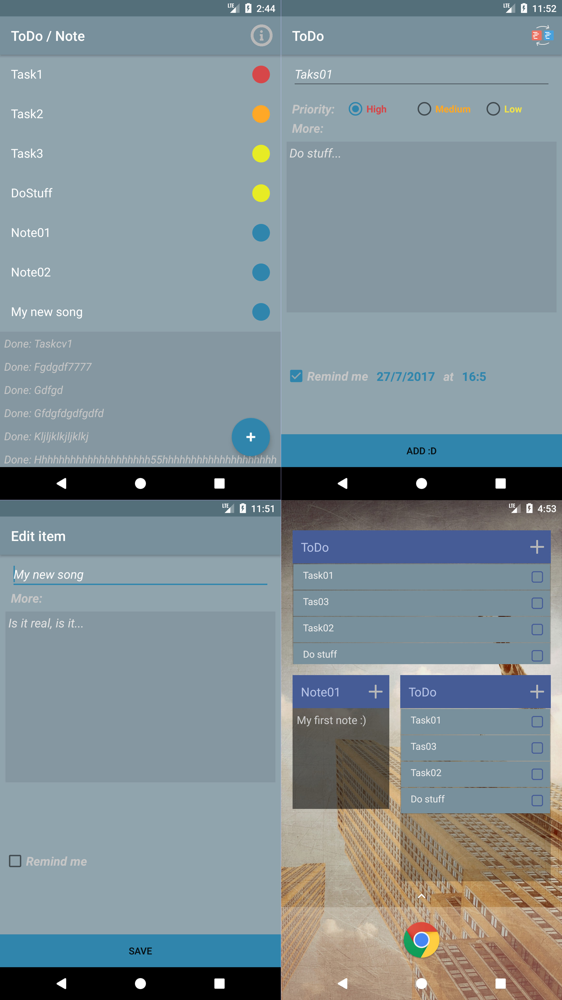

# ToDoNotes  

<!-- preview screenshoot -->

ToDo / Note taking app with dark theme 

## Fatures
~ Add new ToDo / Note  
~ Edit active item  
~ Swipe active item to dismiss it  
~ Swipe done item back to active  
~ Widget for active ToDos  
~ Widget for selected Note  
 

## Soon
~ Time based reminders for ToDos  

## License

Copyright 2017 Petar Suvajac

Licensed under the Apache License, Version 2.0 (the "License");
you may not use this file except in compliance with the License.
You may obtain a copy of the License at

    http://www.apache.org/licenses/LICENSE-2.0

Unless required by applicable law or agreed to in writing, software
distributed under the License is distributed on an "AS IS" BASIS,
WITHOUT WARRANTIES OR CONDITIONS OF ANY KIND, either express or implied.
See the License for the specific language governing permissions and
limitations under the License.
